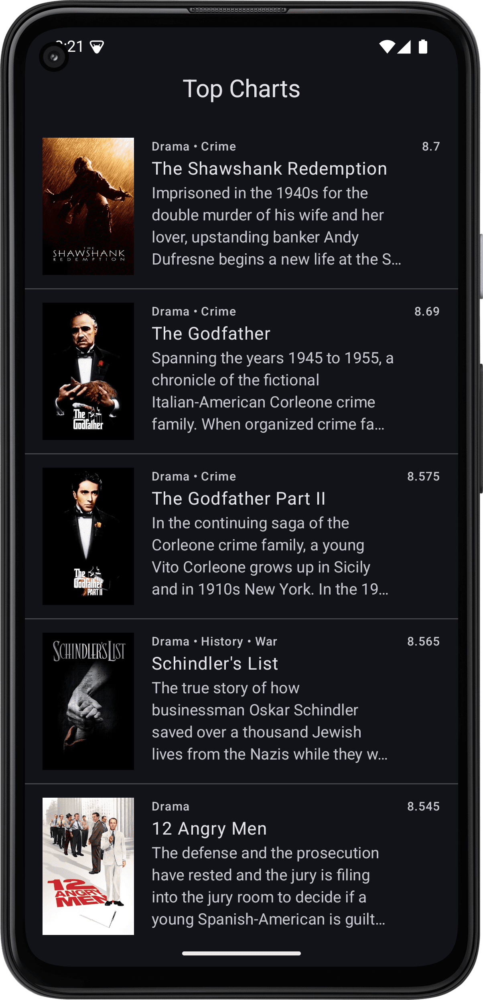
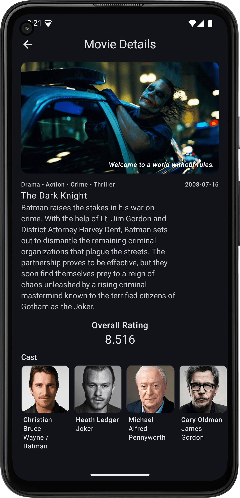
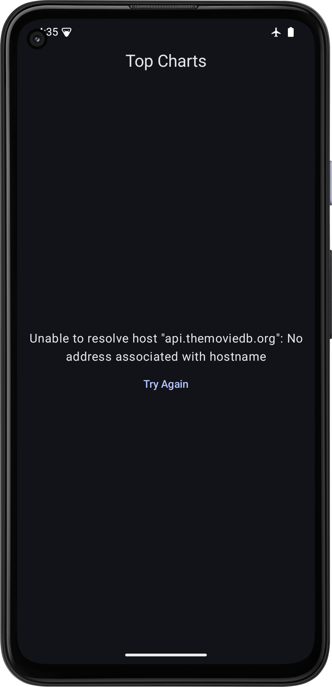
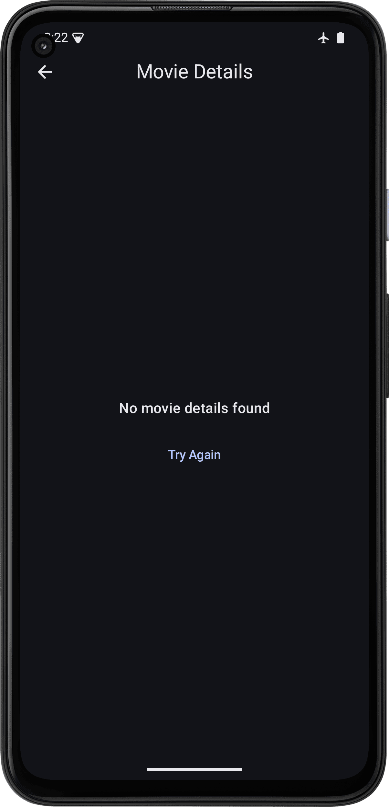

# MovieDB App: Coding Exercise
This is a simple MovieDB app build with Jetpack Compose, MVI, Clean Architecture, Hilt, Retrofit, Coroutines, Flow, Coil, etc.
[Home](#moviedb) | [Features](#features) | [Libraries](#libraries) | [Architecture](#architecture) | [Modules](#modules) | [How to run](#how-to-run)

## Screenshots
| Home                                           | Detail                                              |
|------------------------------------------------|-----------------------------------------------------|
|            |              |
|  |  |

## Features
- List of popular movies
- Movie details

## Libraries
- Jetpack Compose
- Jetpack Navigation
- Hilt
- Retrofit
- Coroutines
- Flow
- Coil
- Mockk
- JUnit5
- Strickt
- Turbine

## Architecture
- Multi Modular Architecture
- Clean Architecture
- MVI
- Repository pattern
- UseCases

## Modules
- app
- core
  - common
  - designsystem
  - navigation
  - network
- features
  - data
  - domain
  - presentation
    - movies
    - moviedetails

## How to run
- Clone the project
- Add token.properties in `token.properties` file
- Run the app
